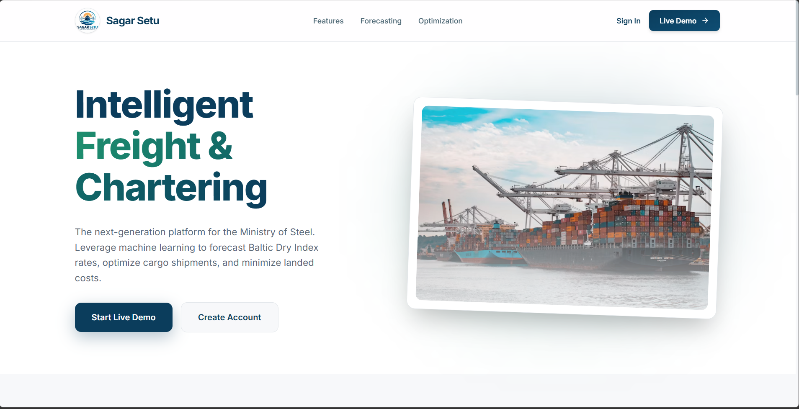
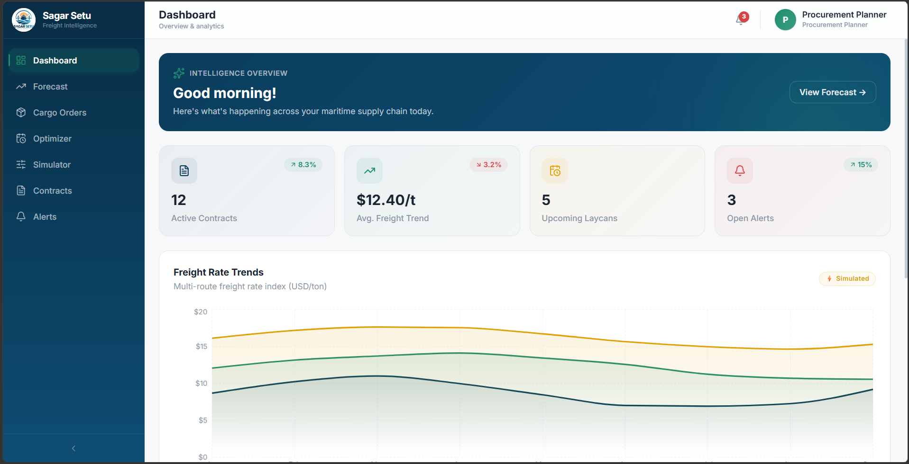
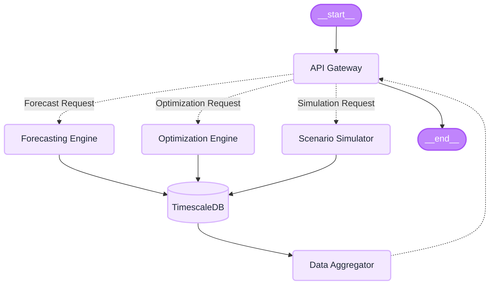

# Sagar Setu - (Intelligent Freight Forecasting)

[](https://www.python.org/)
[](https://fastapi.tiangolo.com/)
[](https://react.dev/)
[](https://www.docker.com/)

## 📋 Overview

**Sagar Setu** is an intelligent, AI-powered software platform developed for the Ministry of Steel (Smart India Hackathon 2026 - SIH26006). It acts as a decision-support "Smart Assistant" that predicts future shipping costs, recommends the perfect ship size, and builds a master schedule to minimize total costs for importing raw materials.

It forecasts freight rates, recommends optimal vessel types, generates optimized procurement schedules, and provides scenario simulation for what-if analysis. The platform is built using a modern stack featuring **React 18**, **FastAPI**, **Machine Learning (SARIMA, Prophet, XGBoost)**, and **Optimization (PuLP)**.


---

## 🎨 Application Preview

### Landing Page


### Dashboard Preview



---

## 🎯 Key Features

### 🧠 Intelligent Freight Forecasting
- **Multi-Model AI**: Uses SARIMA, Prophet, and XGBoost to analyze historical data and predict future prices.
- **Route & Vessel Selection**: Specify routes (e.g., Australia to Visakhapatnam) and vessel classes (Capesize, Panamax).
- **Time Horizons**: Predict rates for 7, 30, or 90 days into the future.

### ⚓ Optimal Vessel Chartering
- **Smart Recommendations**: Automatically suggests the best ship size based on cargo orders and port draft restrictions.
- **Master Scheduling**: Groups multiple small orders into larger shipments using Linear Programming to minimize costs.

### 📊 Scenario Simulation
- **"What-If" Analysis**: Test disaster scenarios (e.g., fuel price spikes, port closures) before they happen.
- **Dynamic Recalculation**: Automatically suggests alternative plans to keep costs down during crises.

### 🔔 Proactive Alerts
- **24/7 Market Monitoring**: Automated warnings when freight rates drop, suggesting optimal booking times.

---

## 🏗️ Architecture Stack

| Component | Technology |
|-----------|-----------|
| **Frontend Framework** | React 18 + TypeScript + Vite + TailwindCSS |
| **Backend API Gateway** | FastAPI (Python) |
| **ML/Forecasting Engine** | SARIMA, Prophet, XGBoost |
| **Optimization Engine** | PuLP (CBC solver) |
| **Relational Database** | PostgreSQL 15 + TimescaleDB |
| **Cache & Real-time** | Redis |
| **Deployment** | Docker & Docker Compose |

### WorkFlow



---

## 📖 Usage Guide

### 1. Prerequisites

- Docker & Docker Compose
- Node.js 20+ (for local frontend dev)
- Python 3.11+ (for local backend dev)

### 2. Environment Configuration

Copy the `.env.example` file to create a `.env` file in the project root:

```bash
cp .env.example .env
```

### 3. Running the Application (Docker)

The easiest way to run the full stack (Frontend, Backend API, PostgreSQL, Redis) is using Docker Compose:

```bash
# Build and start all services in the background
docker-compose up --build -d
```

- **Frontend Application**: http://localhost:5173
- **FastAPI (Backend)**: http://localhost:8000
- **API Docs (Swagger)**: http://localhost:8000/docs
- **PostgreSQL**: localhost:5432
- **Redis**: localhost:6379

### 4. Running Locally for Development

If you prefer to run services manually for development:

**Terminal 1 (Backend):**
```bash
cd backend
python -m venv venv
source venv/bin/activate  # On Windows: venv\Scripts\activate
pip install -r requirements.txt
python -m uvicorn api.main:app --reload --host 0.0.0.0 --port 8000
```

**Terminal 2 (Frontend):**
```bash
cd frontend
npm install
npm run dev
```

---

## 🔌 Core Modules & Endpoints (Backend)

- `/api/` - FastAPI gateway (auth, CRUD, routing).
- `/forecasting/` - ML forecasting service endpoints.
- `/optimization/` - LP/MILP optimization engine.
- `/etl/` - Data ingestion and synthetic data generation.
- `/db/migrations/` - SQL migration files for TimescaleDB.

*(See full API Docs at `http://localhost:8000/docs` for detailed endpoints)*

---

## 🔐 Demo Credentials

Use these credentials to test different user roles on the local/live demo:

| Role | Email | Password |
|---|---|---|
| **Admin** | admin@sagarsetu.gov.in | admin123 |
| **Chartering Officer** | charter@sail.gov.in | charter123 |
| **Procurement Planner** | planner@sail.gov.in | planner123 |
| **Viewer (Ministry)** | viewer@steel.gov.in | viewer123 |

---

## 👤 Author

**Team BlackOut - SIH 2026**
- Project: [Sagar-Setu](https://github.com/Ashmit76311/Sagar-Setu)
